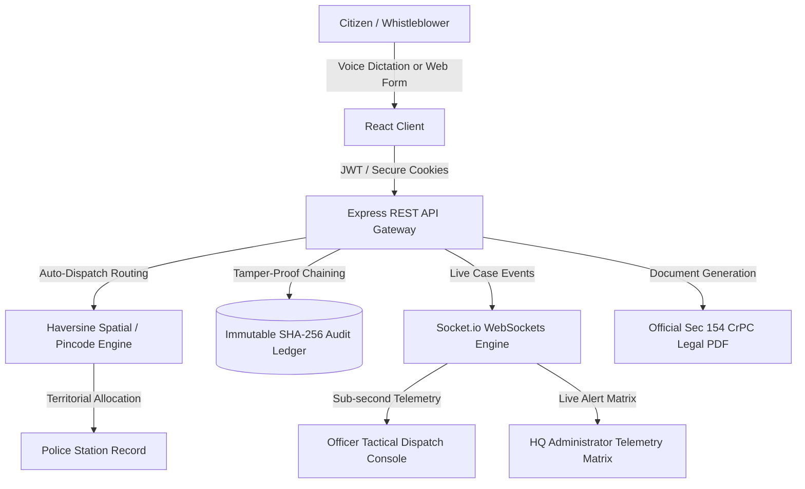
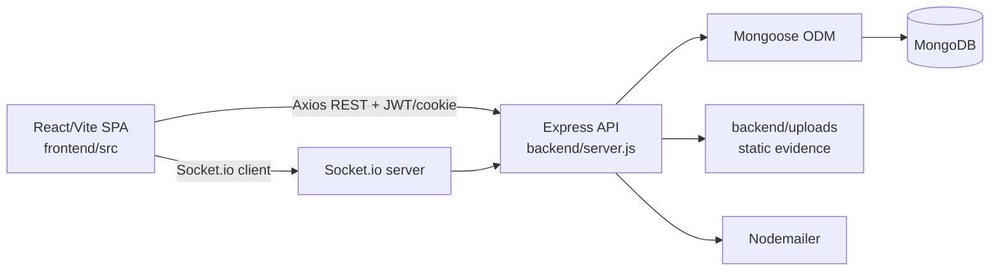
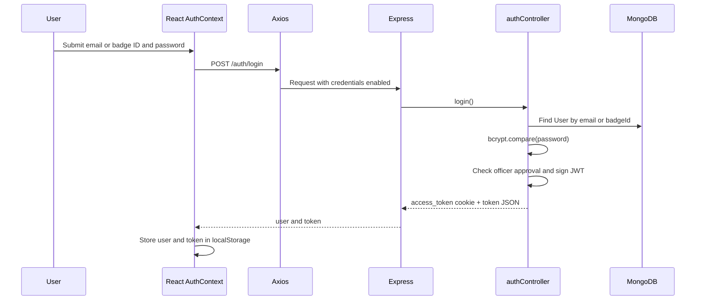
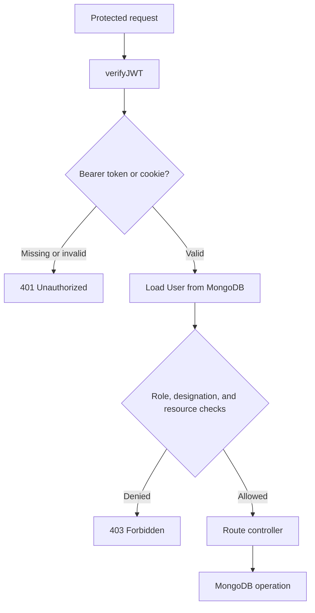
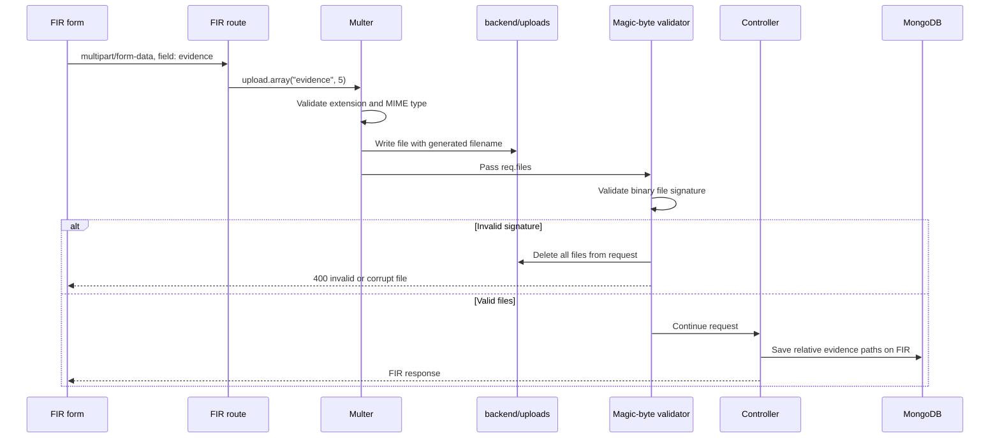
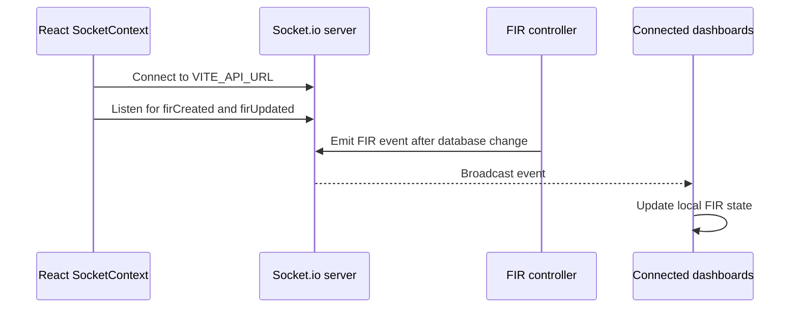
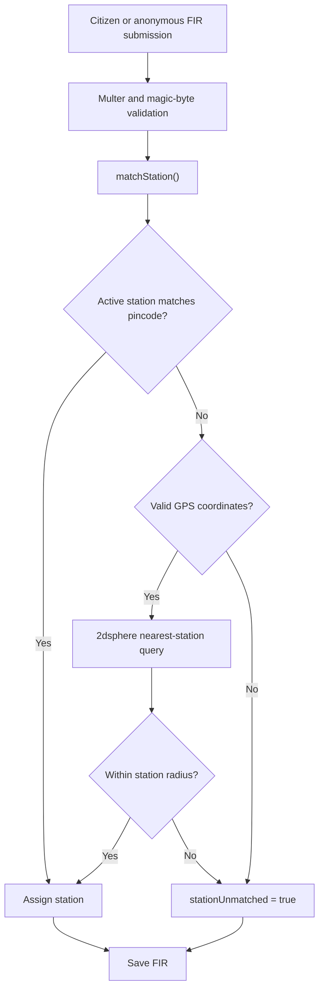

# 🏛️ National E-FIR & Law Enforcement Dispatch Platform

[](https://nodejs.org/)
[](https://react.dev/)
[](https://www.mongodb.com/)
[](https://tailwindcss.com/)
[]()
[]()

A state-of-the-art, secure digital law enforcement and incident management system. Engineered to empower citizens to lodge legally verified First Information Reports (FIRs) and anonymous complaints, while equipping police officers and station superintendents with a real-time tactical dispatch console, automated GIS jurisdiction routing, and tamper-proof forensic audit trails.

---

## 🌟 Key Architecture & Highlights



---

## 🧭 Detailed Runtime Architecture

### System Context



The backend is a single Node.js process that serves Express REST routes, static evidence files, and Socket.io over the same HTTP server. MongoDB is accessed through Mongoose. The frontend is a React SPA that uses Axios for REST calls and a shared Socket.io context for live updates.

### Authentication Flow



Authentication is implemented by `backend/controllers/authController.js`, `backend/routes/authRoutes.js`, `frontend/src/context/AuthContext.jsx`, and `frontend/src/api/axios.js`.

The client sends the JWT as `Authorization: Bearer <token>`. The server also accepts the HTTP-only `access_token` cookie. Tokens expire after one day. Logout clears the cookie and removes the client-side session state.

### RBAC and Request Authorization



| Resource | Authorization |
| :--- | :--- |
| `/auth/*` | Public |
| Anonymous FIR create/track | Public; creation is rate-limited |
| `/api/firs/create`, `/api/firs/my-firs` | Authenticated users |
| `/api/firs/all`, status updates, investigation logs, analytics | `officer` or `admin` plus controller checks where applicable |
| FIR assignment and officer workload | `admin` or `designation: supervisor` |
| FIR audit retrieval | `officer` or `admin` |
| Station listing | `admin` or `designation: supervisor` |
| Remaining admin routes | `admin` only |

The primary guards are in `backend/middlewares/authMiddleware.js`. The backend is the security boundary; frontend route guards only control navigation. FIR controllers additionally check complainant ownership, assigned officer identity, station scope, and supervisor/admin privileges.

### Evidence Upload Flow



Uploads are handled by `backend/middlewares/uploadMiddleware.js`:

* Maximum five files per request.
* Maximum 10 MB per file.
* Allowed types: JPG, JPEG, PNG, MP4, and PDF.
* Validation uses extension, MIME type, and magic bytes.
* Files are served through `/uploads/<filename>`.
* Failed FIR creation triggers disk cleanup.

### Socket.io Flow



Current event names are `firCreated`, `firUpdated`, and `newMessage`. Client listeners exist in `OfficerDashboard.jsx` and `FIRList.jsx`.

**Implementation note:** Controllers currently call `req.io.emit(...)`, but `server.js` does not attach `io` to requests. As a result, these guarded emits are currently skipped. Message delivery also targets a FIR room, but no room-join handler is currently implemented. To activate the designed flow, the server needs request-level `io` injection and a client/server room-join protocol.

### FIR and Jurisdiction Flow



Station matching is implemented in `backend/utils/stationMatcher.js`. It checks pincode first, then performs a geospatial query and Haversine radius check. Unmatched FIRs remain available for administrative rerouting.

### MongoDB Schema

```mermaid
erDiagram
  USER ||--o{ FIR : files
  USER ||--o{ FIR : assigned_to
  STATION ||--o{ USER : contains
  STATION ||--o{ FIR : jurisdiction
  FIR ||--o{ AUDIT_LOG : records
  USER ||--o{ AUDIT_LOG : performs
  FIR ||--o{ FIR_MESSAGE : embeds
  FIR ||--o{ INVESTIGATION_LOG : embeds

  USER {
    ObjectId _id
    string name
    string email UK
    string password
    enum role
    string badgeId
    boolean isApproved
    enum designation
    ObjectId station FK
  }

  FIR {
    ObjectId _id
    ObjectId complainant FK_nullable
    boolean isAnonymous
    string anonymousRefId
    enum incidentType
    string description
    string[] evidence
    enum status
    ObjectId assignedOfficer FK
    ObjectId station FK_nullable
    boolean stationUnmatched
    FIR_MESSAGE messages
    INVESTIGATION_LOG investigationLogs
  }

  STATION {
    ObjectId _id
    string name
    string city
    string state
    string[] pincodes
    number latitude
    number longitude
    Point location
    number radiusKm
    boolean isActive
  }

  AUDIT_LOG {
    ObjectId _id
    ObjectId firId FK
    ObjectId userId FK
    string action
    string resourceType
    string previousHash
    string recordHash
    date timestamp
  }
```

The persistent models are `User`, `FIR`, `Station`, and `AuditLog`. FIR messages and investigation logs are embedded arrays rather than separate collections. Audit entries are intended to be append-only and use a SHA-256 hash chain with Mongoose update/delete guards.

---

## 🚀 Core Features

### 1. 🛡️ Citizen Incident Lodgement & Whistleblower Portal
* **Section 154 CrPC Filing**: Complete legal complaint workflow capturing incident categories, accused/suspect data, exact timestamps, and up to 5 multi-format digital evidence exhibits.
* **Anonymous Crime Reporting**: Whistleblowers can report incidents without entering any personal information. Generates an encrypted 8-character tracking token (e.g. `E5549609`) to track investigative progress anonymously.
* **Live Stepper & Status Tracking**: Visual 4-stage pipeline (`Pending` &rarr; `Accepted` &rarr; `In Progress` &rarr; `Resolved / Rejected`) with direct two-way encrypted chat between complainant and assigned investigating officer.
* **One-Click Legal Document Export**: Generates client-side, watermarked Sec 154 CrPC legal FIR PDFs with embedded case metadata, officer stamps, and evidentiary exhibits.

### 2. 🎙️ Voice-to-Text & Regional Multilingual Support
* **Accessibility for Non-Typing & Illiterate Citizens**: Integrated Web Speech API (`SpeechRecognition`) enabling citizens to dictate their complete factual statement verbally in their mother tongue.
* **8 Indian Regional Languages**: Real-time interface translation and speech processing:
  * **English (India)** (`en-IN`)
  * **हिन्दी (Hindi)** (`hi-IN`)
  * **मराठी (Marathi)** (`mr-IN`)
  * **বাংলা (Bengali)** (`bn-IN`)
  * **தமிழ் (Tamil)** (`ta-IN`)
  * **తెలుగు (Telugu)** (`te-IN`)
  * **ગુજરાતી (Gujarati)** (`gu-IN`)
  * **ಕನ್ನಡ (Kannada)** (`kn-IN`)
* **Text-to-Speech (Audio Readback)**: `SpeechSynthesis` read-aloud functionality allows citizens to listen to their transcribed deposition to confirm factual accuracy before final submission.

### 3. 🔒 Immutable Forensic Audit Ledger (Tamper-Proof Chain of Custody)
* **Automatic Forensic Tracking**: Every single time an FIR or piece of digital evidence is viewed, downloaded, or updated, an unalterable log record is generated.
* **Captured Telemetry**:
  * Officer Identification (`userId`, `userName`, `userRole`, `badgeId`)
  * Network Origin (Normalized IPv4/IPv6 client IP via reverse proxies)
  * Action Type (`VIEW_FIR`, `VIEW_EVIDENCE`, `DOWNLOAD_PDF`, `UPDATE_STATUS`, `ADD_DIARY_LOG`, `ASSIGN_OFFICER`)
  * Immutable Timestamp (`Date.now()`)
* **Cryptographic Block Chaining (SHA-256)**: Each audit entry computes a cryptographic hash anchored to the previous log’s hash (`previousHash`), preventing log insertion, modification, or reordering.
* **Mongoose Model-Level Immature Lock**: Strictly rejects any update (`updateOne`, `findOneAndUpdate`) or deletion (`deleteOne`, `deleteMany`) operations at the database layer.

### 4. 🚓 Real-Time Officer Investigation Console
* **Dual-Method Clearance Authentication**: Officers can authenticate with either their official **Police Badge ID** (e.g., `MH-POL-1001`) or registered **Official Email**.
* **Real-Time WebSockets (`Socket.io`)**: Instant push updates and audio sirens for high-priority incidents, case updates, and citizen messages without page reloads.
* **Interactive Crime Map**: Leaflet OpenStreetMap canvas plotting geotagged incidents across city districts with color-coded severity pulse rings.
* **Section 172 CrPC Investigation Case Diary**: Official digital case diary enabling officers to append legally recognized investigation notes with digital timestamps.

### 5. 🗺️ Automatic Territorial Jurisdiction Routing
* Automatically resolves 6-digit postal pincodes and GPS coordinates (latitude/longitude) to the nearest territorial Police Station using spatial Haversine geodesic algorithms.
* Fallback flagging (`stationUnmatched: true`) alerting headquarters for manual administrative rerouting if out of territory.

### 6. 📊 Executive Crime Telemetry & Analytics
* **Real-time Crime Matrix**: Incident type distributions (Theft, Assault, Cybercrime, Fraud) visualised via Chart.js doughnut graphs.
* **City & Station Jurisdiction Breakdown**: Horizontal bar charts displaying station load balancing and regional case volume.
* **Personnel Workload & Clearance**: Administrators can review officer load, approve pending officer badges, and manage police station registries.

---

## 🛠️ Technology Stack

| Layer | Technology | Purpose |
| :--- | :--- | :--- |
| **Frontend UI** | React 19, Vite 7 | High-performance SPA with fast client bundling |
| **Styling & UX** | Tailwind CSS 3.4, Lucide Icons | Tactical high-contrast law enforcement design system |
| **Speech & Audio** | Web Speech API (`SpeechRecognition`, `SpeechSynthesis`) | Hands-free multilingual speech-to-text and narration |
| **Backend API** | Node.js, Express.js | Modular RESTful API and route controller architecture |
| **Database** | MongoDB, Mongoose ODM | Document datastore with 2dsphere spatial indexing |
| **Real-Time** | Socket.io | Bi-directional event broadcasting for dispatch alerts |
| **Security & Auth**| JWT, Bcrypt.js, SHA-256 Cryptography | HTTP-only cookie auth, RBAC guards, and immutable ledgers |
| **GIS & Visuals** | Leaflet, React-Leaflet, Chart.js | Spatial mapping and dynamic statistical charts |
| **PDF Generation** | jsPDF, html2canvas | Official Sec 154 CrPC legal document exports |

---

## 📁 Repository Structure

```text
FIR/
├── backend/
│   ├── config/             # Database connection & environment configuration
│   ├── controllers/
│   │   ├── adminController.js   # Personnel clearance, station CRUD, rerouting
│   │   ├── authController.js    # Dual Badge/Email login & registration
│   │   └── firController.js     # FIR lifecycle, case diary, messaging, audits
│   ├── middlewares/
│   │   ├── authMiddleware.js    # JWT verification & RBAC role guards
│   │   ├── uploadMiddleware.js  # Multer file upload & magic-byte validation
│   │   └── rateLimiter.js       # IP brute-force & DDoS submission limiter
│   ├── models/
│   │   ├── AuditLog.js          # Tamper-proof SHA-256 audit ledger schema
│   │   ├── FIR.js               # Sec 154 complaint data & case diary model
│   │   ├── Station.js           # Police station coordinates & territorial areas
│   │   └── User.js              # Citizen, Officer, and Admin identities
│   ├── routes/                  # Express route definitions (/auth, /firs, /admin)
│   ├── utils/
│   │   ├── auditLogger.js       # Telemetry & cryptographic hashing service
│   │   ├── stationMatcher.js    # Spatial & pincode jurisdiction resolver
│   │   └── emailService.js      # Status notification mailer
│   └── server.js                # Express & Socket.io entry point
│
├── frontend/
│   ├── src/
│   │   ├── api/axios.js         # Configured Axios instance with interceptors
│   │   ├── components/
│   │   │   ├── AIChatbot.jsx    # Floating legal assistant with voice input
│   │   │   ├── CaseDossier.jsx  # Complete case viewer & forensic audit modal
│   │   │   ├── FIRForm.jsx      # Multilingual FIR lodgement form
│   │   │   ├── FIRList.jsx      # Docket search & status stepper cards
│   │   │   ├── LanguageSelector.jsx # Regional language selector
│   │   │   ├── LocationPicker.jsx   # Leaflet GPS incident location picker
│   │   │   ├── Navbar.jsx       # Tactical top header with ticker & language
│   │   │   ├── StatusStepper.jsx    # Procedural status step progress bar
│   │   │   └── VoiceInput.jsx   # Speech-to-text and audio readback component
│   │   ├── context/
│   │   │   ├── AuthContext.jsx      # User identity & clearance session state
│   │   │   ├── LanguageContext.jsx  # App-wide regional language provider
│   │   │   └── SocketContext.jsx    # Socket.io real-time connection provider
│   │   ├── pages/
│   │   │   ├── AdminDashboard.jsx     # Station network & personnel management
│   │   │   ├── AnalyticsDashboard.jsx # Crime trend charts & spatial heatmaps
│   │   │   ├── AnonymousFIR.jsx       # Whistleblower reporting & tracking
│   │   │   ├── CitizenDashboard.jsx   # Citizen cases, filing CTA & timeline
│   │   │   ├── Home.jsx               # Portal homepage with legal guidelines
│   │   │   ├── Login.jsx              # Citizen authentication portal
│   │   │   ├── OfficerDashboard.jsx   # Dispatch console, map & case drawer
│   │   │   ├── OfficerLogin.jsx       # Dual Badge ID / Email clearance login
│   │   │   └── Register.jsx           # Public citizen registration
│   │   └── utils/
│   │       ├── pdfGenerator.js        # CrPC compliant legal PDF exporter
│   │       └── translations.js        # 8-Language translation dictionary
│   └── vite.config.js
└── README.md
```

---

## ⚙️ Installation & Setup

### Prerequisites
* **Node.js**: v18.0.0 or later
* **MongoDB**: Running instance locally (`mongodb://localhost:27017`) or a MongoDB Atlas URI

### 1. Clone the Repository
```bash
git clone <repository-url>
cd <repository-directory>
```

### 2. Configure Backend Environment
Create a `.env` file in the `backend/` directory:
```env
PORT=5000
NODE_ENV=development
MONGO_URI=mongodb://localhost:27017/efir_db
JWT_SECRET=your_super_secret_jwt_key_here
CLIENT_URL=http://localhost:5173
```

### 3. Install Dependencies
```bash
# Install backend dependencies
cd backend
npm install

# Install frontend dependencies
cd ../frontend
npm install
```

### 4. Seed Territorial Police Stations (Optional but Recommended)
Populate police stations across Maharashtra & Mumbai for jurisdiction auto-routing:
```bash
cd ../backend
node scripts/seedStations.js
```

### 5. Launch the Application
In separate terminal windows (or using `run.bat` on Windows):

**Start Backend Server:**
```bash
cd backend
npm start
# Server running at: http://localhost:5000
```

**Start Frontend Client:**
```bash
cd frontend
npm run dev
# Application accessible at: http://localhost:5173
```

---

## 📡 API Reference Overview

### Authentication (`/auth`)
* `POST /auth/register` — Register a new citizen account
* `POST /auth/login` — Dual authentication (Badge ID or Email + Password)
* `POST /auth/logout` — Invalidate session and clear HTTP-only cookies

### FIR Operations (`/api/firs`)
* `POST /api/firs/create` — Lodge official FIR with evidence multipart upload
* `POST /api/firs/anonymous/create` — Lodge anonymous complaint with tracking token
* `POST /api/firs/anonymous/track` — Query case status using 8-character token
* `GET  /api/firs/my-firs` — Retrieve all FIRs filed by authenticated citizen
* `GET  /api/firs/all` — Officer jurisdiction-scoped case retrieval
* `PUT  /api/firs/update/:id` — Update status (`Pending` &rarr; `In Progress` &rarr; `Resolved`)
* `POST /api/firs/update/:id/log` — Append Section 172 CrPC case diary entry
* `POST /api/firs/update/:id/message` — Send two-way complainant-officer message
* `PUT  /api/firs/assign/:id` — Assign investigating officer to FIR

### Tamper-Proof Audit Trails (`/api/firs/audit`)
* `POST /api/firs/audit/log` — Record immutable audit event (`VIEW_FIR`, `VIEW_EVIDENCE`, `DOWNLOAD_PDF`)
* `GET  /api/firs/audit/:id` — Inspect chronological, SHA-256 hashed chain of custody for a case

### Administration (`/api/admin`)
* `GET  /api/admin/stats` — Statewide system metrics (Citizens, Officers, FIRs, Audits)
* `GET  /api/admin/officers` — View all registered officers & approval states
* `PUT  /api/admin/approve-officer/:id` — Grant active duty clearance to officer badge
* `GET  /api/admin/stations` — List territorial police station registry
* `PUT  /api/admin/reroute/:firId` — Manually reroute FIR to another station

---

## 🛡️ Security & Privacy Guardrails
1. **Cryptographic Chaining**: Audit logs employ SHA-256 hashing anchored to the prior block hash, making retroactive modification computationally detectable.
2. **Database Immutability**: Mongo Mongoose interceptors throw strict runtime exceptions on any `update` or `delete` attempt on audit records.
3. **Magic-Byte MIME Verification**: File uploads undergo binary magic-number validation to prevent executable disguising or script injection.
4. **Rate Limiting**: Integrated window-based rate limiting on anonymous submissions and auth endpoints to block DDoS and credential stuffing attacks.

---

## 📄 License
This project is open-source and developed under the **MIT License**.